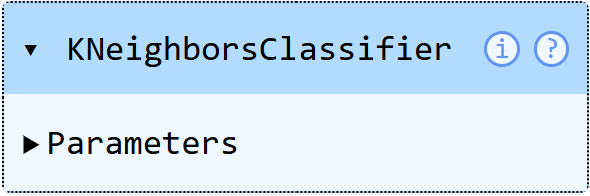
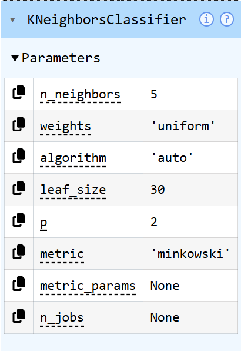

# scikit-learn (my own notes)

So first of all we need to install all our packages. Four scikit-learn we need: scikit-learn, numpy (for working with arrays) , pandas (for working with dataframes), matplotlib (for visualisation) and jupyterlab. JupyterLab is very useful for Data Science and Machine Learning because it allows code to be executed step by step instead of running the entire program at once. This makes debugging easier, helps analyze data interactively, and allows results such as tables and visualizations to appear directly below the code. Variables and datasets remain in memory, which makes experimentation faster and more efficient, especially when working with pandas, time series, sensor data, and machine learning models.
```python
pip3 install scikit-learn numpy pandas matplotlib 
```
```python
pip3 install jupyterlab
```
Then open the jupyter lab window:

```python
jupyter lab
```
What I am going to do is to train simple classification model to detect breast cancer.
```python
from sklearn.datasets import load_breast_cancer        # loads the data_set
from sklearn.model_selection import train_test_split   # allows me to split the data into a training portion and into a testing portion
from sklearn.preprocessing import StandardScaler       # for scaling the data
from sklearn.neighbors import KNeighborsClassifier     # special type of classifier (breast cancer yes or no)
```
```python
data = load_breast_cancer(as_frame=True).frame         # loaded as a data frame
```
```python
data                                                   # data will show up after this command
```


When we look at the target column we see the numbers 0 and 1. 
0 stands for malignant.
1 stands for benign.

Now we do a X, y split, but why? In Machine Learning, we want to know: Can the model perform well on unseen data. 
If we train and test on the same data the model may simply memorize the dataset but fail on new real-world data. That's called overfittig.

```python
from sklearn.datasets import load_breast_cancer        # loads the data_set
from sklearn.model_selection import train_test_split   # allows me to split the data into a training portion and into a testing portion
from sklearn.preprocessing import StandardScaler       # for scaling the data
from sklearn.neighbors import KNeighborsClassifier     # special type of classifier (breast cancer yes or no)

X, y = load_breast_cancer(return_X_y=True)             # X, y Split
X
```
Output:                                                               
```
array([[1.799e+01, 1.038e+01, 1.228e+02, ..., 2.654e-01, 4.601e-01,
        1.189e-01],
       [2.057e+01, 1.777e+01, 1.329e+02, ..., 1.860e-01, 2.750e-01,
        8.902e-02],
       [1.969e+01, 2.125e+01, 1.300e+02, ..., 2.430e-01, 3.613e-01,
        8.758e-02],
       ...,
       [1.660e+01, 2.808e+01, 1.083e+02, ..., 1.418e-01, 2.218e-01,
        7.820e-02],
       [2.060e+01, 2.933e+01, 1.401e+02, ..., 2.650e-01, 4.087e-01,
        1.240e-01],
       [7.760e+00, 2.454e+01, 4.792e+01, ..., 0.000e+00, 2.871e-01,
        7.039e-02]], shape=(569, 30))
```
The output is a multidimensional numpy array with the feature values without the labels/names anymore.

```python
y
```

Output
```
array([0, 0, 0, 0, 0, 0, 0, 0, 0, 0, 0, 0, 0, 0, 0, 0, 0, 0, 0, 1, 1, 1,
       0, 0, 0, 0, 0, 0, 0, 0, 0, 0, 0, 0, 0, 0, 0, 1, 0, 0, 0, 0, 0, 0,
       0, 0, 1, 0, 1, 1, 1, 1, 1, 0, 0, 1, 0, 0, 1, 1, 1, 1, 0, 1, 0, 0,
       1, 1, 1, 1, 0, 1, 0, 0, 1, 0, 1, 0, 0, 1, 1, 1, 0, 0, 1, 0, 0, 0,
       1, 1, 1, 0, 1, 1, 0, 0, 1, 1, 1, 0, 0, 1, 1, 1, 1, 0, 1, 1, 0, 1,
       1, 1, 1, 1, 1, 1, 1, 0, 0, 0, 1, 0, 0, 1, 1, 1, 0, 0, 1, 0, 1, 0,
       0, 1, 0, 0, 1, 1, 0, 1, 1, 0, 1, 1, 1, 1, 0, 1, 1, 1, 1, 1, 1, 1,
       1, 1, 0, 1, 1, 1, 1, 0, 0, 1, 0, 1, 1, 0, 0, 1, 1, 0, 0, 1, 1, 1,
       1, 0, 1, 1, 0, 0, 0, 1, 0, 1, 0, 1, 1, 1, 0, 1, 1, 0, 0, 1, 0, 0,
       0, 0, 1, 0, 0, 0, 1, 0, 1, 0, 1, 1, 0, 1, 0, 0, 0, 0, 1, 1, 0, 0,
       1, 1, 1, 0, 1, 1, 1, 1, 1, 0, 0, 1, 1, 0, 1, 1, 0, 0, 1, 0, 1, 1,
       1, 1, 0, 1, 1, 1, 1, 1, 0, 1, 0, 0, 0, 0, 0, 0, 0, 0, 0, 0, 0, 0,
       0, 0, 1, 1, 1, 1, 1, 1, 0, 1, 0, 1, 1, 0, 1, 1, 0, 1, 0, 0, 1, 1,
       1, 1, 1, 1, 1, 1, 1, 1, 1, 1, 1, 0, 1, 1, 0, 1, 0, 1, 1, 1, 1, 1,
       1, 1, 1, 1, 1, 1, 1, 1, 1, 0, 1, 1, 1, 0, 1, 0, 1, 1, 1, 1, 0, 0,
       0, 1, 1, 1, 1, 0, 1, 0, 1, 0, 1, 1, 1, 0, 1, 1, 1, 1, 1, 1, 1, 0,
       0, 0, 1, 1, 1, 1, 1, 1, 1, 1, 1, 1, 1, 0, 0, 1, 0, 0, 0, 1, 0, 0,
       1, 1, 1, 1, 1, 0, 1, 1, 1, 1, 1, 0, 1, 1, 1, 0, 1, 1, 0, 0, 1, 1,
       1, 1, 1, 1, 0, 1, 1, 1, 1, 1, 1, 1, 0, 1, 1, 1, 1, 1, 0, 1, 1, 0,
       1, 1, 1, 1, 1, 1, 1, 1, 1, 1, 1, 1, 0, 1, 0, 0, 1, 0, 1, 1, 1, 1,
       1, 0, 1, 1, 0, 1, 0, 1, 1, 0, 1, 0, 1, 1, 1, 1, 1, 1, 1, 1, 0, 0,
       1, 1, 1, 1, 1, 1, 0, 1, 1, 1, 1, 1, 1, 1, 1, 1, 1, 0, 1, 1, 1, 1,
       1, 1, 1, 0, 1, 0, 1, 1, 0, 1, 1, 1, 1, 1, 0, 0, 1, 0, 1, 0, 1, 1,
       1, 1, 1, 0, 1, 1, 0, 1, 0, 1, 0, 0, 1, 1, 1, 0, 1, 1, 1, 1, 1, 1,
       1, 1, 1, 1, 1, 0, 1, 0, 0, 1, 1, 1, 1, 1, 1, 1, 1, 1, 1, 1, 1, 1,
       1, 1, 1, 1, 1, 1, 1, 1, 1, 1, 1, 1, 0, 0, 0, 0, 0, 0, 1])
```
y is the target what we are trying to predict (0 or 1).

That's the general format for scikit-learn. Now we can split the data into training and testing data:

```python
X_train, X_test, y_train, y_test = train_test_split(X, y, test_size=0.2, random_state=73)    #20% data for testing, 80% for training, 
```

Now we can also scale the data:

```python
scaler = StandardScaler()

X_train_scaled = scaler.fit_transform(X_train)
X_test_scaled = scaler.transform(X_test)
```
Now to the k-nearest neighbor:

```python
knn = KNeighborsClassifer()
knn.fit(X_train_scaled, y_train)
```
Output

<p float="left">
  
  
</p>
